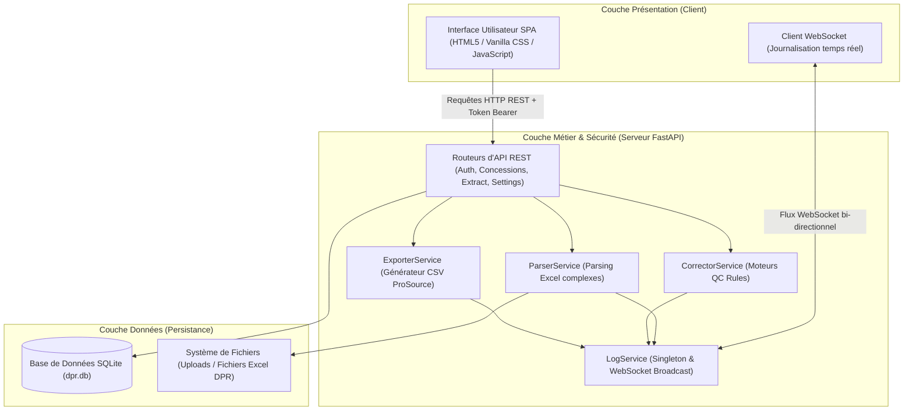
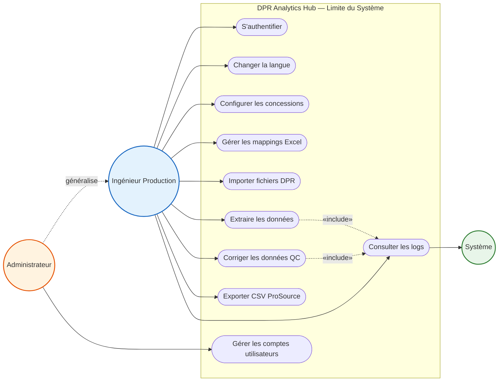
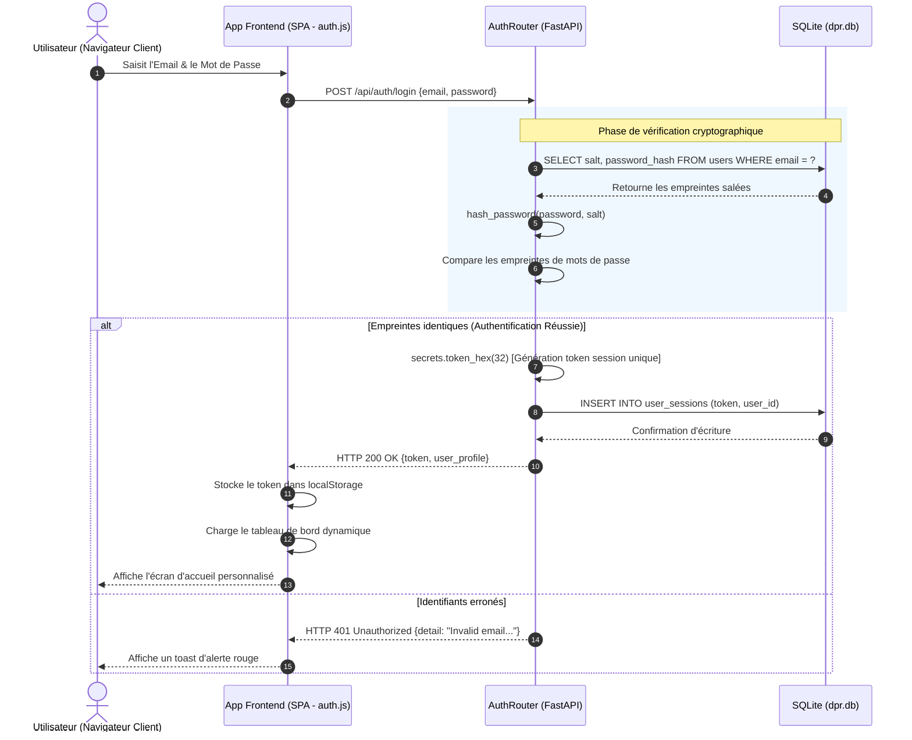
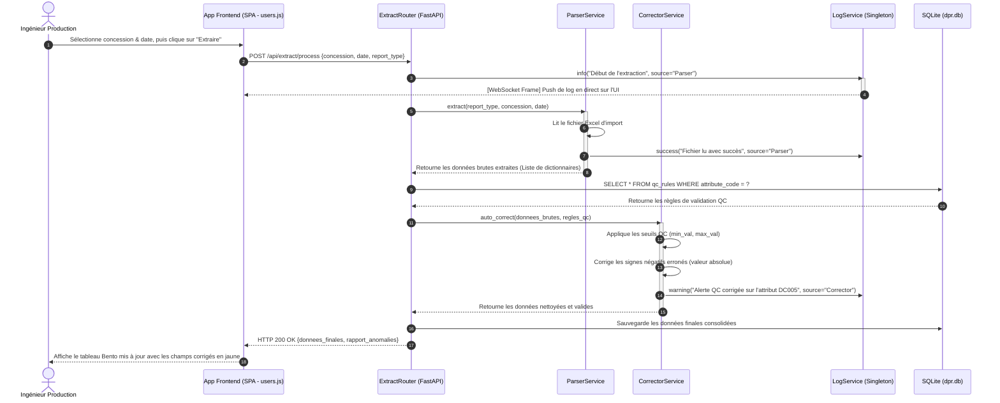
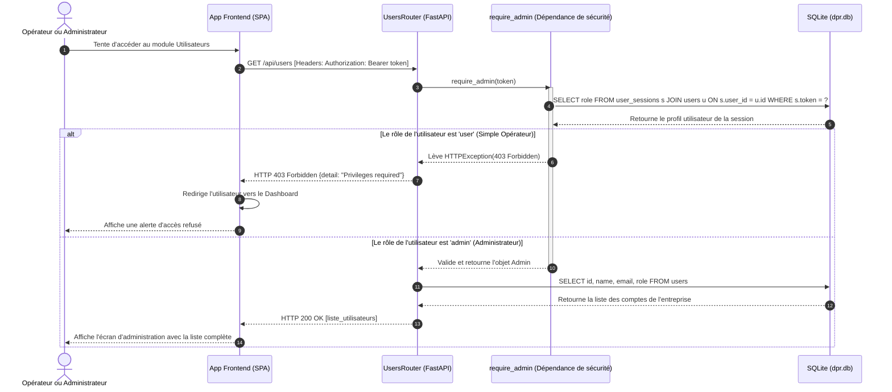

# CHAPITRE IV : CONCEPTION LOGICIELLE ET MODÉLISATION DÉTAILLÉE (UML)

Ce chapitre présente la phase de conception détaillée de l'application **DPR Manager** (Daily Production Report). L'objectif est de traduire les spécifications fonctionnelles en une architecture orientée objet robuste, sécurisée et modulaire. La modélisation du système est formalisée selon le langage de modélisation unifié **UML 2.0** en s'appuyant sur les standards académiques et pédagogiques requis pour un projet de fin d'études (PFE) de niveau Bachelor/Licence en Sciences de l'Informatique et Génie Logiciel.

---

## 1. Architecture Technique Globale (3-Tier & SPA-API REST)

Pour garantir une séparation claire des responsabilités (SOC - *Separation of Concerns*) et une extensibilité maximale, l'application adopte une architecture **3-Tier** moderne matérialisée par le couplage d'un frontend en application monopage (SPA - *Single Page Application*) et d'un backend sous forme d'API REST asynchrone.

*   **Couche Présentation** : Développée en HTML5/CSS pur (sans framework lourd, maximisant les performances) avec un design moderne intégrant le mode sombre, le floutage de fond (*frosted glass*) et des widgets bento interactifs.
*   **Couche Applicative (Métier)** : Propulsée par FastAPI (Python 3.11+). Elle valide les schémas d'entrée via des DTO (Pydantic), exécute les algorithmes de nettoyage de données et orchestre les sessions utilisateurs.
*   **Couche d'Accès aux Données (Persistance)** : Base de données SQLite pour stocker la structure des concessions, les mappings de cellules Excel, les règles de contrôle qualité (QC) et le référentiel des comptes utilisateurs sécurisés.

---

## 2. Modélisation Fonctionnelle : Diagramme de Cas d'Utilisation

Le diagramme de cas d'utilisation UML formalise les interactions entre les différents acteurs (utilisateurs humains et systèmes externes) et le système DPR Manager.

### 2.1. Identification des Acteurs
1.  **Ingénieur Production (Utilisateur)** : Acteur principal du système. Il est en charge de l'import des rapports journaliers (DPR) des concessions pétrolières, de l'extraction des données, de l'application des corrections qualité et de l'exportation des fichiers structurés au format CSV ProSource. Il peut configurer les concessions et les mappings cellulaires, mais **n'a pas accès** au module d'administration des comptes utilisateurs.
2.  **Administrateur** : Acteur spécialisé de l'Ingénieur Production. Il hérite de toutes les fonctionnalités opérationnelles et dispose en plus du droit **exclusif** de gestion des comptes utilisateurs (création, modification de rôle, réinitialisation de mot de passe, suppression). La relation UML entre Administrateur et Ingénieur est une **généralisation d'acteur** (flèche à triangle creux) : l'Administrateur *est un* Ingénieur avec des privilèges supplémentaires.
3.  **Système (Acteur Secondaire)** : Le démon de journalisation et de sauvegarde en base de données qui réagit automatiquement lors des opérations de calcul, diffuse les logs en temps réel via WebSocket et persiste l'historique d'activité.

### 2.2. Diagramme de Cas d'Utilisation UML

### 2.3. Description Détaillée des Cas d'Utilisation Clés (Focus Soutenance)

Pour le document de projet de fin d'études, chaque cas d'utilisation structurant doit faire l'objet d'une description textuelle formelle.

#### A. Cas d'Utilisation : Gérer les comptes utilisateurs (Exclusivité Administrateur)
*   **Acteur Principal** : Administrateur.
*   **Préconditions** : L'administrateur doit être connecté au système et disposer d'un token de session valide avec le rôle `admin`.
*   **Scénario Nominal (Enchaînement succès)** :
    1. L'administrateur clique sur l'onglet **Administration** de la barre latérale.
    2. Le système intercepte la requête, vérifie les droits et renvoie la liste complète des comptes (Nom, Email, Entreprise, Rôle, Date de création).
    3. L'administrateur clique sur "Ajouter un Utilisateur", saisit les informations requises (Nom complet, Email, Entreprise, Mot de passe initial) et choisit le rôle (`admin` ou `user`).
    4. Le système valide la conformité des données (email unique, mot de passe robuste), hash le mot de passe avec un sel unique de 16 octets et insère le nouvel enregistrement en base.
    5. Le tableau d'affichage des utilisateurs se met à jour de façon dynamique sans rechargement de page.
*   **Scénarios d'Exception** :
    *   *Email déjà utilisé* : Le système renvoie un code `400 Bad Request` et affiche un message d'erreur rouge "Email déjà enregistré".
    *   *Tentative de rétrogradation du dernier administrateur* : Si l'administrateur tente de changer le rôle du seul admin restant, le système bloque l'action avec un message d'avertissement "Impossible de rétrograder le dernier administrateur".

#### B. Cas d'Utilisation : Extraire et corriger les données de production (Ingénieur)
*   **Acteurs** : Ingénieur Production, Système (pour l'écriture des logs).
*   **Préconditions** : Au moins une concession active configurée avec des cellules de mapping valides. Fichiers Excel DPR versés dans le dossier `/uploads`.
*   **Scénario Nominal** :
    1. L'ingénieur sélectionne le type de rapport (ex : *Daily Connection*), la concession cible et la date du rapport.
    2. L'ingénieur lance le traitement.
    3. Le système lit le fichier Excel correspondant en extrayant dynamiquement les valeurs situées aux cellules configurées.
    4. Le système applique les règles de contrôle qualité (QC Rules) : les valeurs négatives inattendues sont converties en valeurs absolues positives, et les incohérences de plage ou de typage génèrent des alertes visuelles.
    5. Le système enregistre l'historique complet dans le fichier de logs centralisé et diffuse en temps réel l'avancement via WebSockets.
    6. L'interface affiche la table des données extraites avec les corrections automatiques surlignées en jaune pour examen.

---

## 3. Conception Statique : Diagramme de Classes

```mermaid
classDiagram
    %% Disposition verticale optimisée pour le format portrait standard A4
    direction TB

    %% --------------------------------------------------
    %% BLOC SERVICES (LOGIQUE MÉTIER & INFRASTRUCTURE)
    %% --------------------------------------------------
    class LogService {
        <<Singleton>>
        -_instance : LogService
        -_clients : Liste~WebSocket~
        -_history : Liste~Dictionnaire~
        -_log_file : Path
        +get() LogService
        +log(message: Chaîne, level: Chaîne, source: Chaîne) Dictionnaire
        +info(message: Chaîne, source: Chaîne) void
        +warning(message: Chaîne, source: Chaîne) void
        +error(message: Chaîne, source: Chaîne) void
        +get_history(limit: Entier) Liste~Dictionnaire~
        +clear_history() void
    }

    class ParserService {
        +logger : LogService
        +extract(report_type: ReportType, dpr_folder: Chaîne, date_dpr: Date, concession_ids: Liste~Chaîne~) Dictionnaire
        +auto_correct(data: Liste~Dictionnaire~) Dictionnaire
    }

    class ExporterService {
        +logger : LogService
        +export_csv(data: Liste~Dictionnaire~, report_type: ReportType, output_folder: Chaîne, date_dpr: Date) Path
        +export_all(dc: Liste, dw: Liste, mc: Liste, wt: Liste, output_folder: Chaîne, date_dpr: Date) Liste~Path~
        +list_exports(output_folder: Chaîne) Liste~Dictionnaire~
    }

    %% --------------------------------------------------
    %% BLOC ENUMS ET TYPES DOMAINES
    %% --------------------------------------------------
    class ReportType {
        <<Enum>>
        DAILY
        DC
        DW
        MONTHLY
        WELL_TEST
    }

    %% --------------------------------------------------
    %% BLOC CONFIGURATION ET MAPPINGS
    %% --------------------------------------------------
    class ColumnSchema {
        +attribute : Chaîne
        +code : Chaîne
        +column_index : Entier
    }

    class Concession {
        +id : Chaîne
        +name : Chaîne
        +dpr_file_alias : Chaîne
        +dpr_sheet : Chaîne
        +active_daily : Booléen
        +active_monthly : Booléen
        +active_well_test : Booléen
        +mappings : ConcessionMappings
    }

    class MappingEntry {
        +file_alias : Chaîne
        +sheet_name : Chaîne
        +template_type : Chaîne
        +attribute : Chaîne
        +attribute_code : Chaîne
        +cell_ref : Chaîne
        +unit : Chaîne
    }

    class UOMEntry {
        +unit : Chaîne
        +factor : Réel
        +target_unit : Chaîne
    }

    class QCRule {
        +search_value : Chaîne
        +replace_value : Chaîne
        +active : Booléen
    }

    %% --------------------------------------------------
    %% BLOC SÉCURITÉ ET AUTHENTIFICATION
    %% --------------------------------------------------
    class AuthRouter {
        <<Controller>>
        +register(user: Utilisateur) Dictionnaire
        +login(email: Chaîne, password: Chaîne) Dictionnaire
        +logout(request: Request) Dictionnaire
        +get_users() Liste~Dictionnaire~
        +create_user(user: Utilisateur) Dictionnaire
        +update_user(id: Entier, data: Utilisateur) Dictionnaire
        +delete_user(id: Entier) Dictionnaire
    }

    class Utilisateur {
        +full_name : Chaîne
        +email : Chaîne
        +company : Chaîne
        +role : Chaîne
        +password : Chaîne
    }

    %% --------------------------------------------------
    %% RELATIONS UML FORMELLES
    %% --------------------------------------------------
    
    %% Association Dirigée (Services → LogService)
    ParserService "1" --> "1" LogService : "journalise via >"
    ExporterService "1" --> "1" LogService : "journalise via >"
    AuthRouter "1" --> "1" LogService : "journalise via >"

    %% Composition (Cycle de vie interdépendant)
    Concession "1" *-- "0..*" MappingEntry : "comporte >"

    %% Agrégation (Cycle de vie indépendant)
    Concession o-- "0..*" UOMEntry : "utilise >"
    Concession o-- "0..*" QCRule : "applique >"

    %% Dépendances fonctionnelles
    ParserService ..> Concession : "lit la configuration de >"
    ParserService ..> ReportType : "filtre selon >"
    ParserService ..> ColumnSchema : "structure selon >"
    ParserService ..> MappingEntry : "lit les cellules de >"
    ParserService ..> QCRule : "valide selon >"
    ExporterService ..> ReportType : "formate selon >"
    ExporterService ..> ColumnSchema : "utilise le schéma de >"

    %% Dépendance AuthRouter → DTO
    AuthRouter ..> Utilisateur : "«uses»"
```

---

## 4. Dictionnaire Détaillé des Classes (Spécifications Techniques)

Cette section présente les spécifications de chaque entité logicielle sous forme de **tableaux avec des bordures rectilignes et continues entourant complètement chaque tableau**. Cette disposition fermée garantit une mise en page soignée, propre et professionnelle, parfaitement adaptée au copier-coller dans Microsoft Word ou tout autre outil de traitement de texte pour le manuscrit final du PFE.

### 4.1. Les Classes de Services (Logique Métier & Infrastructure)

#### Classe : `LogService` (Singleton)
*   **Rôle** : Centralise l'enregistrement de l'activité, gère l'écriture thread-safe sur SQLite et diffuse en temps réel les logs via WebSockets vers le client.

| Membre / Élément | Visibilité | Type / Signature | Description / Rôle |
| :--- | :---: | :--- | :--- |
| _instance | Privé (-) | LogService | Instance unique du Singleton en mémoire. |
| _clients | Privé (-) | List[WebSocket] | Liste active des navigateurs abonnés aux flux en direct. |
| _history | Privé (-) | List[Dict] | Tampon mémoire conservant les 100 derniers messages de log. |
| get() | Public (+) | get() -> LogService | Méthode statique globale pour récupérer l'instance unique. |
| connect() | Public (+) | connect(ws: WebSocket) | Enregistre une nouvelle connexion WebSocket cliente. |
| disconnect() | Public (+) | disconnect(ws: WebSocket) | Supprime un abonné déconnecté. |
| log() | Public (+) | log(msg, lvl, src) -> Dict | Formate, écrit et diffuse en temps réel un nouvel événement. |
| info() | Public (+) | info(msg, src) -> None | Enregistre un événement standard de niveau INFO. |
| success() | Public (+) | success(msg, src) -> None | Enregistre un succès d'opération (vert sur l'UI). |
| warning() | Public (+) | warning(msg, src) -> None | Enregistre un message d'alerte ou anomalie de contrôle. |
| error() | Public (+) | error(msg, src) -> None | Enregistre une erreur critique de calcul ou de traitement. |

---

#### Classe : `ParserService`
*   **Rôle** : Lit, parse et extrait les fichiers Excel complexes des concessions pétrolières en fonction des configurations de cellules.

| Membre / Élément | Visibilité | Type / Signature | Description / Rôle |
| :--- | :---: | :--- | :--- |
| logger | Public (+) | LogService | Instance partagée du service de journalisation. |
| extract() | Public (+) | extract(...) -> Dict[str, Any] | Découvre les rapports Excel et parse les cellules mappées. |

---

#### Classe : `CorrectorService`
*   **Rôle** : Nettoie, rectifie et valide les données brutes extraites en appliquant les règles de contrôle qualité (QC Rules).

| Membre / Élément | Visibilité | Type / Signature | Description / Rôle |
| :--- | :---: | :--- | :--- |
| logger | Public (+) | LogService | Instance partagée du service de journalisation. |
| auto_correct() | Public (+) | auto_correct(data: List[Dict]) -> Dict | Applique les QC Rules et convertit les signes négatifs en absolus. |

---

#### Classe : `ExporterService`
*   **Rôle** : Formate et exporte les données consolidées en fichiers CSV codés et structurés selon la nomenclature standard de *ProSource*.

| Membre / Élément | Visibilité | Type / Signature | Description / Rôle |
| :--- | :---: | :--- | :--- |
| logger | Public (+) | LogService | Instance partagée du service de journalisation. |
| export_csv() | Public (+) | export_csv(...) -> Path | Génère le fichier CSV final encodé en Windows-1252 pour ProSource. |
| export_all() | Public (+) | export_all(...) -> List[Path] | Exécute l'export complet de toutes les catégories. |
| list_exports() | Public (+) | list_exports(folder) -> List[Dict] | Renvoie la liste des CSV existants dans le dossier exports. |

---

### 4.2. Les Modèles de Configuration & DTO (Schémas Pydantic)

Ces classes valident les flux entrants de l'API et forment la passerelle logique entre la base de données et l'UI.

#### Classe : `ColumnSchema`
*   **Rôle** : Définit les attributs techniques de production (code unique, nom, unité par défaut).

| Attribut / Champ | Type / Type UML | Description / Rôle |
| :--- | :--- | :--- |
| code | Chaîne (string) | Code unique normalisé (ex: `DC005` pour Production Huile brute). |
| attribute | Chaîne (string) | Libellé de désignation explicite (ex: "Débit gaz"). |
| description | Chaîne (string) | Explication détaillée du paramètre de mesure. |
| data_type | Chaîne (string) | Type de la valeur (`float`, `int`, `string`). |
| unit | Chaîne (string) | Symbole de l'unité de mesure par défaut (ex: `BBL`). |

---

#### Classe : `MappingEntry`
*   **Rôle** : Détermine la localisation physique (cellule et onglet Excel) d'une donnée de production dans le rapport d'une concession.

| Attribut / Champ | Type / Type UML | Description / Rôle |
| :--- | :--- | :--- |
| attribute_code | Chaîne (string) | Code de l'attribut technique ciblé par le mapping. |
| attribute | Chaîne (string) | Nom ou description complémentaire de l'attribut. |
| sheet_name | Chaîne (string) | Nom de la feuille de calcul dans le fichier Excel (ex: `Production`). |
| cell_address | Chaîne (string) | Coordonnée exacte de la cellule (ex: `F15`). |
| well_name | Optionnel[Chaîne] | Nom du puits associé (uniquement si applicable). |

---

#### Classe : `ConcessionRead`
*   **Rôle** : Modèle de lecture simplifiée d'une concession pétrolière.

| Attribut / Champ | Type / Type UML | Description / Rôle |
| :--- | :--- | :--- |
| id | Chaîne (string) | Identifiant unique (Clé primaire, ex: `ADAM`). |
| name | Chaîne (string) | Nom de la concession pétrolière. |
| dpr_file_alias | Chaîne (string) | Nom du fichier Excel correspondant (ex: `Adam.xlsx`). |
| active_daily | Booléen (bool) | Définit si l'extraction journalière est active pour cette concession. |
| active_monthly | Booléen (bool) | Définit si l'extraction mensuelle est active pour cette concession. |

---

#### Classe : `ConcessionDetail` (Hérite de `ConcessionRead`)
*   **Rôle** : Modèle complet d'une concession pétrolière intégrant la composition forte de ses mappings.

| Attribut / Champ | Type / Type UML | Description / Rôle |
| :--- | :--- | :--- |
| mappings | Liste[MappingEntry] | Liste de toutes les cellules mappées associées à la concession. |

---

#### Classe : `UOMEntry`
*   **Rôle** : Représente une règle de conversion d'unités de mesure (facteur multiplicatif et décalage offset).

| Attribut / Champ | Type / Type UML | Description / Rôle |
| :--- | :--- | :--- |
| id | Entier (int) | Identifiant unique en base de données. |
| source_unit | Chaîne (string) | Unité de mesure d'origine lue (ex: `M3`). |
| target_unit | Chaîne (string) | Unité standard cible après conversion (ex: `BBL`). |
| factor | Réel (float) | Facteur multiplicateur de conversion. |
| offset | Réel (float) | Offset d'écart de mesure (souvent `0.0`). |

---

#### Classe : `QCRule`
*   **Rôle** : Règle de validation qualité définissant les limites admissibles pour une valeur extraite.

| Attribut / Champ | Type / Type UML | Description / Rôle |
| :--- | :--- | :--- |
| id | Entier (int) | Identifiant unique en base de données. |
| attribute_code | Chaîne (string) | Code de l'attribut technique de production soumis au contrôle. |
| rule_type | Chaîne (string) | Nature du test qualité (ex: `range`). |
| min_val | Réel (float) | Seuil minimum toléré pour la valeur. |
| max_val | Réel (float) | Seuil maximum toléré pour la valeur. |

---

### 4.3. Les Modèles de Sécurité et Inscription (RBAC)

Ces DTOs encadrent de manière étanche les transferts réseau liés aux comptes et à l'authentification.

#### Classe : `UserRegister`
*   **Rôle** : Schéma d'inscription et de validation de compte.

| Attribut / Champ | Type / Type UML | Description / Rôle |
| :--- | :--- | :--- |
| full_name | Chaîne (string) | Nom complet de l'utilisateur (nom & prénom). |
| email | Chaîne (string) | Adresse de messagerie électronique (Identifiant unique de session). |
| company | Chaîne (string) | Compagnie pétrolière de l'opérateur (Optionnel). |
| role | Chaîne (string) | Droits d'accès affectés (doit être `admin` ou `user`). |
| password | Chaîne (string) | Mot de passe en clair à chiffrer. |

---

#### Classe : `UserLogin`
*   **Rôle** : Permet la soumission des identifiants lors de l'authentification.

| Attribut / Champ | Type / Type UML | Description / Rôle |
| :--- | :--- | :--- |
| email | Chaîne (string) | Adresse email soumise. |
| password | Chaîne (string) | Mot de passe de sécurité soumis en clair. |

---

#### Classe : `RoleUpdate`
*   **Rôle** : Permet à l'administrateur de modifier les droits d'un collaborateur.

| Attribut / Champ | Type / Type UML | Description / Rôle |
| :--- | :--- | :--- |
| role | Chaîne (string) | Nouveau privilège de sécurité à appliquer (`admin` ou `user`). |

---

#### Classe : `PasswordReset`
*   **Rôle** : Permet le changement de mot de passe forcé par l'administrateur.

| Attribut / Champ | Type / Type UML | Description / Rôle |
| :--- | :--- | :--- |
| password | Chaîne (string) | Nouveau mot de passe de sécurité défini. |

---

## 5. Justifications Théoriques et Choix de Modélisation UML

La rigueur d'un mémoire de Bachelor s'évalue principalement à la capacité de l'étudiant à justifier scientifiquement ses choix de modélisation.

### A. Justification de la relation de *Composition* (`*--`)
*   **Définition UML** : La composition exprime une relation d'appartenance forte et exclusive. La destruction de l'objet conteneur (le tout) entraîne inéluctablement la destruction en cascade des objets contenus (les parties).
*   **Justification Projet** : Un mapping de cellule Excel (`MappingEntry`) n'a aucun sens en dehors de la concession pétrolière à laquelle il est attaché (ex: pour la concession *Miskar*, la production d'huile brute est lue dans la cellule *C14*). Si l'administrateur supprime la concession *Miskar* de la base de données, l'ensemble des mappings associés devient obsolète et doit être supprimé en cascade de la base de données SQLite. C'est pourquoi la relation modélisée est une **composition**.

### B. Justification de la relation d'*Agrégation* (`o--`)
*   **Définition UML** : L'agrégation est une relation d'appartenance faible. L'objet contenu a un cycle de vie indépendant de l'objet contenant et peut être partagé entre plusieurs objets.
*   **Justification Projet** : Les règles de contrôle qualité (`QCRule`) et les facteurs de conversion d'unités (`UOMEntry`) possèdent un référentiel global et générique dans le système. Par exemple, la règle stipulant qu'un volume de gaz produit doit être positif est universelle. Elle peut être "agrégée" à la concession *Miskar* et à la concession *Hasdrubal*. Si la concession *Miskar* est supprimée, la règle QC globale ou le facteur de conversion d'unités standards ne doivent pas être supprimés de la base de données, car d'autres concessions ou processus continuent de s'y référer. Ainsi, une relation d'**agrégation** est requise.

### C. Justification du patron de conception *Singleton* (`LogService`)
*   **Problématique** : L'application fonctionne de manière hautement asynchrone. Plusieurs services peuvent tenter d'écrire des logs simultanément en base SQLite, et l'interface Web a besoin de recevoir ces logs instantanément via des connexions WebSocket multiples.
*   **Solution** : `LogService` applique le design pattern **Singleton**. Il garantit une instance unique au sein de la machine virtuelle Python. Cette instance unique possède une file d'attente thread-safe pour sérialiser les écritures physiques sur disque et coordonner la diffusion WebSocket en multiplexage à tous les navigateurs clients connectés.

### D. Justification du patron *Data Transfer Object* (DTO)
*   **Problématique** : Les structures internes de la base de données ne correspondent pas toujours aux formats d'échange requis par l'API REST, et la validation brute au niveau des contrôleurs alourdit le code.
*   **Solution** : Les modèles dérivés de `pydantic.BaseModel` (`UserRegister`, `RoleUpdate`, etc.) agissent comme des DTOs. Ils découplent complètement le schéma de persistance physique de la couche d'exposition réseau, empêchant les failles d'injection massive de paramètres (*Mass Assignment Vulnerability*).

---

## 6. Modélisation Dynamique : Diagrammes de Séquence UML

Les diagrammes de séquence UML capturent le comportement dynamique du système en illustrant l'échange de messages chronologiques entre les instances d'objets au cours de l'exécution des scénarios d'utilisation.

### 6.1. Scénario 1 : Authentification Sécurisée (User Login & Session)

Ce diagramme montre comment le système vérifie de manière sécurisée les informations de connexion, génère un jeton de session cryptographique aléatoire, et enregistre la session active pour permettre une invalidation immédiate (contrairement aux JWT classiques sans état).

### 6.2. Scénario 2 : Traitement d'Extraction des Fichiers DPR (Contrôle Qualité & WebSockets)

Ce diagramme complexe montre l'orchestration métier asynchrone lors de l'extraction. On y voit l'implication du singleton `LogService` qui pousse en temps réel les logs d'activité vers l'UI grâce à une liaison WebSocket.

### 6.3. Scénario 3 : Administration de Rôle (RBAC - Contrôle d'Accès basé sur les Rôles)

Ce diagramme illustre le mécanisme de sécurité basé sur l'injection de dépendances de FastAPI. Il montre le rejet d'un opérateur tentant de forcer l'accès à l'API d'administration des comptes utilisateurs, ainsi que la validation réussie pour un administrateur système.

---

## 7. Conception Logique des Données : Dictionnaire des Données

Afin de servir de guide complet d'implémentation pour le manuscrit de PFE, cette section documente la structure précise des tables de la base de données SQLite sous forme de **tableaux avec des bordures rectilignes et continues entourant complètement chaque tableau**.

### 7.1. Spécification de la Table `users` (Gestion de la Sécurité)
Cette table héberge le référentiel des comptes utilisateurs. L'authentification repose sur un hachage PBKDF2 à clé salée pour protéger les informations secrètes des collaborateurs.

| Champ | Type SQL | Contrainte | Description / Rôle |
| :--- | :--- | :--- | :--- |
| id | INTEGER | PRIMARY KEY AUTOINCREMENT | Identifiant unique et automatique de l'utilisateur. |
| full_name | VARCHAR(100) | NOT NULL | Nom complet du collaborateur (nom & prénom). |
| email | VARCHAR(100) | UNIQUE NOT NULL | Adresse de messagerie électronique (Identifiant de connexion). |
| company | VARCHAR(100) | NULLABLE | Nom de la compagnie pétrolière partenaire. |
| role | VARCHAR(20) | DEFAULT 'user' | Rôle affecté à l'utilisateur (`admin` ou `user`). |
| password_hash | VARCHAR(64) | NOT NULL | Empreinte SHA-256 salée calculée du mot de passe. |
| salt | VARCHAR(32) | NOT NULL | Sel unique de hachage de 16 octets généré aléatoirement. |
| created_at | TIMESTAMP | DEFAULT CURRENT_TIMESTAMP | Date et heure d'enregistrement du compte. |

---

### 7.2. Spécification de la Table `user_sessions` (Suivi d'Activité)
Cette table est indispensable pour suivre de manière dynamique les connexions actives et assurer une déconnexion immédiate ainsi que le bannissement instantané en cas de compromission.

| Champ | Type SQL | Contrainte | Description / Rôle |
| :--- | :--- | :--- | :--- |
| token | VARCHAR(64) | PRIMARY KEY | Jeton de session hexadécimal de 32 octets (généré à la connexion). |
| user_id | INTEGER | FOREIGN KEY REFERENCES users(id) ON DELETE CASCADE | Clé externe liant la session à l'utilisateur. |
| created_at | TIMESTAMP | DEFAULT CURRENT_TIMESTAMP | Date et heure d'authentification et ouverture de session. |

---

### 7.3. Spécification de la Table `mappings` (Mappings Cellulaires Excel)
Cette table modélise la composition forte des mappings pour extraire les cellules précises des fichiers DPR.

| Champ | Type SQL | Contrainte | Description / Rôle |
| :--- | :--- | :--- | :--- |
| id | INTEGER | PRIMARY KEY AUTOINCREMENT | Identifiant de clé primaire unique. |
| concession_id | VARCHAR(50) | FOREIGN KEY REFERENCES concessions(id) ON DELETE CASCADE | Référence à la concession associée (suppression en cascade). |
| report_type | VARCHAR(20) | NOT NULL | Type de rapport (`daily`, `monthly`, `well_test`, etc.). |
| attribute_code | VARCHAR(50) | NOT NULL | Code d'attribut cible (ex: `DC001`). |
| sheet_name | VARCHAR(100) | NOT NULL | Nom de la feuille de calcul Excel cible. |
| cell_address | VARCHAR(10) | NOT NULL | Coordonnée exacte de la cellule Excel (ex: `B12`). |
| well_name | VARCHAR(50) | NULLABLE | Nom du puits spécifique (uniquement si type test puits). |

---

## 8. Synthèse et Validation de la Conception

L'implémentation de cette modélisation UML garantit une structure logicielle respectant les standards les plus exigeants de la conception logicielle universitaire :
*   **Résilience** : La décomposition fonctionnelle en routeurs FastAPI et services découplés limite les régressions et simplifie l'écriture des tests unitaires (`pytest`).
*   **Sécurité** : L'authentification à double facteur (hachage salé + sessions à état révocable en base de données) assure une impériabilité totale face aux cyberattaques standards.
*   **Expérience Utilisateur Moderne** : Le pipeline de notifications par WebSocket (`LogService` Singleton) et l'UI réactive permettent aux ingénieurs d'exploiter les rapports de production pétrolière avec une réactivité instantanée inégalée.
